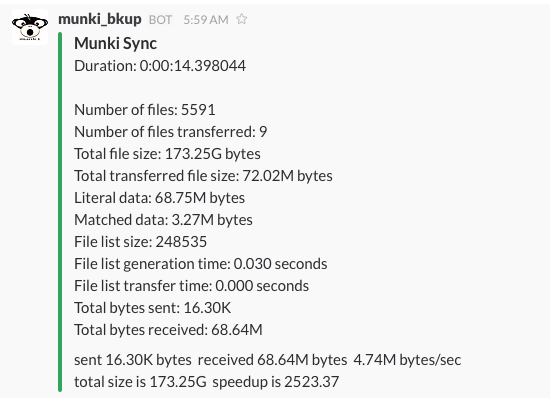

sync_slack
===

Sometimes you just to know if your Rsync run worked or not. Slack has a great API for quick "notices". This is an example script that runs a rsync command and sends the status output to Slack. Quite a few of the bits are hardcoded because I was too lazy to make variables for everything. 

_NOTE:_ This is script is designed to "pull" files from a server to a local directory. Rsync can run in either a "pull" or "push" method. If you want "push" modifications to the rsync method will be needed.

## Setup
In order to use this script, the `requests` module for python must be installed prior to usage. This can be done with:  

	sudo easy_install pip
	sudo pip install requests

Make sure and change the following variable to match your environment:

    webhook_url = 'https://hooks.slack.com/services/XXXX/XXXX/XXXX'
    slack_channel = 'some_slack_channel'
    slack_username = 'sync_bot'
    rsync_user = 'some_user'
    rsync_host = 'some_hostname'
    from_path = '/path/on/rsync_host/you/want/to/sync'
    save_path = '/path/on/current_host/you/want/to/sync/to'
    log_path = '/some/path/to/some_log.log'

## Sample Output

The output in your slack channel will look like: 

## LaunchDaemon

Also, included in this directory is a sample LaunchDaemon. This script can also be ran on-demand or with any other launch method you wish, however I'm using a LaunchDaemon due to the fact that if my backup computer reboots I want to make sure the script is still ran (even at the loginwindow).

Make changes as needed to the LaunchDaemon, specifically the `StartCalendarInterval` and `UserName`. Then run the following:

    sudo cp ./com.clburlison.sync_slack.plist /Library/LaunchDaemons
    sudo chown root:wheel /Library/LaunchDaemons/com.clburlison.sync_slack.plist
    sudo chmod 644 /Library/LaunchDaemons/com.clburlison.sync_slack.plist
    sudo launchctl load /Library/LaunchDaemons/com.clburlison.sync_slack.plist

## Python Error
You might receive an error depending on which version of python your system is running:

    /Library/Python/2.7/site-packages/requests/packages/urllib3/util/ssl_.py:100: InsecurePlatformWarning: A true SSLContext object is not available. This prevents urllib3 from configuring SSL appropriately and may cause certain SSL connections to fail. For more information, see https://urllib3.readthedocs.org/en/latest/security.html#insecureplatformwarning. 
    InsecurePlatformWarning

More info can be found here: [insecureplatformwarning](https://urllib3.readthedocs.org/en/latest/security.html#insecureplatformwarning)

AKA - not issue with this script...

## Other Rsync flags
In this scripts current form most of the Rsync bits and pieces are hardcoded into the script. Most of the time I have no need to change them however rsync has some nice flags that you might wish to add in depending on your environment:

    # SSH options, use a non-standard port (2837), disable StrictHostKeyChecking, Alterative SSH HostsFile, and use SSH identity key.
    -e "ssh -p2837 -o StrictHostKeyChecking=no -o UserKnownHostsFile=/dev/null -i /home/username/.ssh/1234-identity"
     
    # Limit network throughput
    –bwlimit=KBps
    

Obviously, the full list of flags are available in the man pages

## Credit
Initial Slack API parts written by [@groob](https://github.com/groob) in the [MacAdmins](http://macadmins.org) #imagr Slack channel on Nov 12, 2015.
